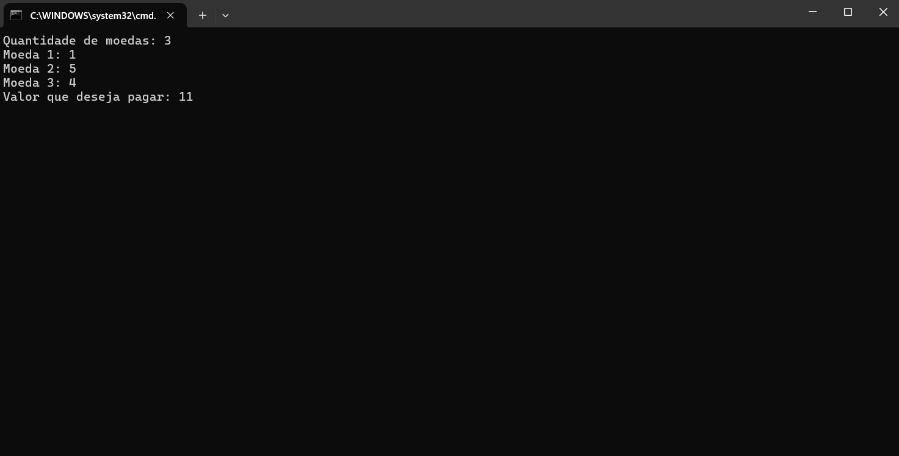
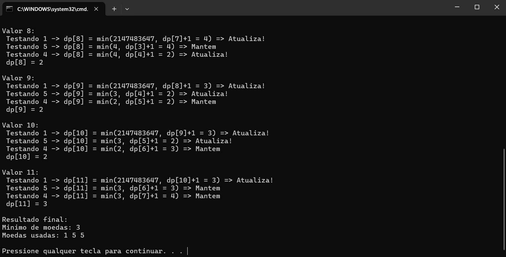

# 🔍 Demonstrando Algoritmo Ambicioso - Coin Change

**Conteúdo da Disciplina:**

- Weighted Interval Scheduling
- Bellman Ford
- Knapsack
- Sequence Alignment
- Coin Change  

## 👨‍🏫 Responsável

| Matrícula   | Aluno             |
|-------------|-------------------|
| 202045482   | [Genilson Silva](https://github.com/GenilsonJrs)    |

---

## 📋 Sobre

Este trabalho tem como objetivo implementar, de forma visual e interativa, a representação de algoritmo vista em sala.

Este projeto busca reforçar conceitos teóricos com uma visualização prática e didática.

---

## 🖼️ Screenshots

<p align="center">Figura 1 - Valores Coins</p>

<p align="center">
  
</p>

<p align="center" style="font-size: 14px;">
  Autor: 
  <a href="https://github.com/GenilsonJrs" target="_blank">Genilson Silva</a>
</p>

---

<p align="center">Figura 2 - Resultado</p>

<p align="center">
  
</p>

<p align="center" style="font-size: 14px;">
  Autor: 
  <a href="https://github.com/GenilsonJrs" target="_blank">Genilson Silva</a>
</p>

---

### 🎥 Vídeo de Apresentação

Neste vídeo, apresento o trabalho desenvolvido, abordando os principais pontos desenvolvidos ao longo do projeto.

[Assista no Youtube]()

---

### ✅ Pré-requisitos

- Compilador C instalado (ex: GCC)
- Terminal compatível com comandos do sistema
- Sistema operacional: **Windows ou Linux**

---

## ⚙️ Instalação e Execução

**Linguagem:** C
**Framework:** Nenhum

1. **Clone o repositório:**

```bash
git clone https://github.com/projeto-de-algoritmos-2025/Grafos1_Concept.git
```
2. **Entre na pasta do projeto:**

```bash
cd PD_GC_Code
```
3. **Compile o código (Windows ou Linux):**

```bash
gcc main.c -o programa
./programa
```


---

## ▶️ Uso

Após executar o programa, siga os seguintes passos:

- Digite a quantidade de moedas que deseja.

- Insira os valores das moedas uma por uma.

- Informe o valor que deseja pagar.

O programa irá:

- Mostrar como preenche a tabela passo a passo.

- Exibir o número mínimo de moedas necessárias.

- Informar quais moedas foram utilizadas na combinação final (se houver solução).

---

## 🧠 Outros

- Coin Change resolve o menor número de moedas necessário para formar um valor, usando subproblemas já resolvidos para construir a resposta final.

- Knapsack (Mochila 0/1) seleciona itens com pesos e valores para maximizar o valor total sem ultrapassar a capacidade da mochila, testando cada combinação possível de forma otimizada.

- Bellman-Ford encontra os menores caminhos em grafos com arestas negativas, atualizando as distâncias várias vezes com base nos vizinhos, até atingir a solução ideal.

- Weighted Interval Scheduling seleciona tarefas com tempos e pesos diferentes, maximizando o valor total sem sobreposição, a partir de escolhas binárias entre incluir ou não cada tarefa.

- Sequence Alignment compara duas sequências (como DNA ou strings) minimizando diferenças e penalidades por desalinhamento, preenchendo uma matriz de forma dinâmica.

